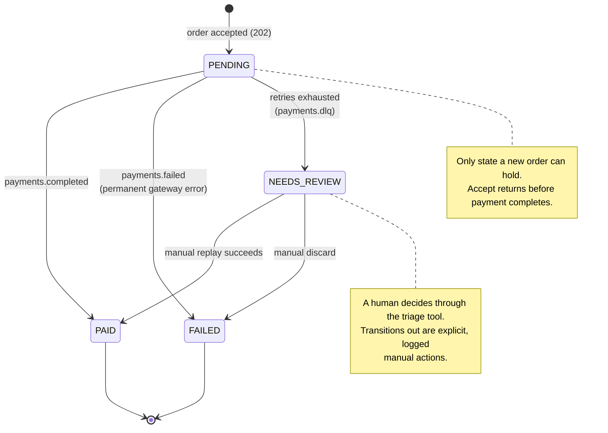

# Order State Machine

```mermaid
stateDiagram-v2
    [*] --> PENDING : order accepted (202)
    PENDING --> PAID : payments.completed
    PENDING --> FAILED : payments.failed<br/>(permanent gateway error)
    PENDING --> NEEDS_REVIEW : retries exhausted<br/>(payments.dlq)
    NEEDS_REVIEW --> PAID : manual replay succeeds
    NEEDS_REVIEW --> FAILED : manual discard
    PAID --> [*]
    FAILED --> [*]

    note right of PENDING
        Only state a new order can hold.
        Accept returns before payment completes.
    end note
    note right of NEEDS_REVIEW
        A human decides through the triage tool.
        Transitions out are explicit, logged
        manual actions.
    end note
```

`PAID` and `FAILED` are terminal: they never change except by an explicit, logged manual action. See [ARCHITECTURE.md](../ARCHITECTURE.md#order-state-machine).
